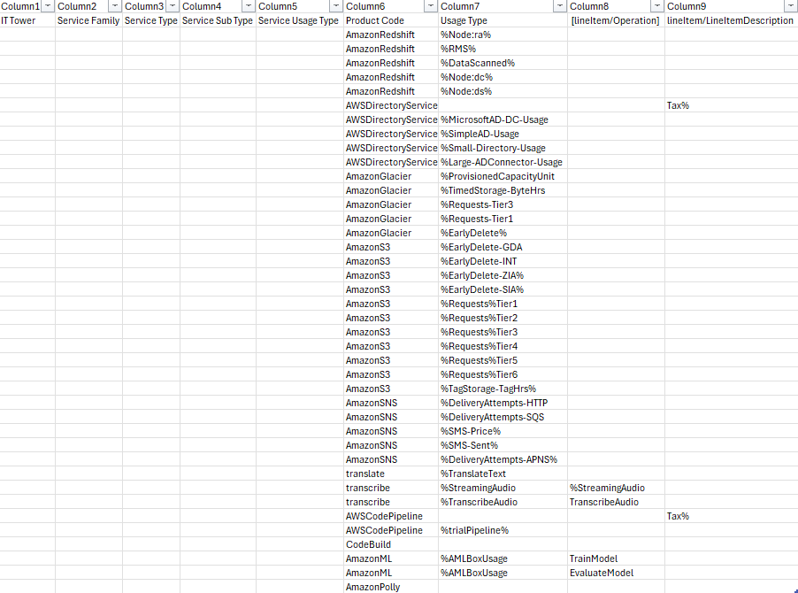
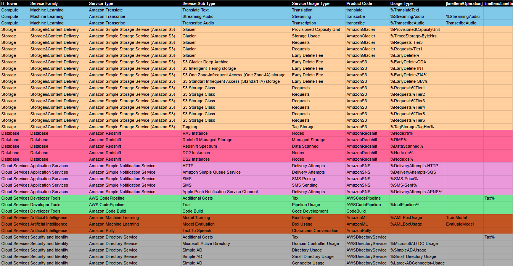

# Отчёт по лабораторной работе 1. Знакомство с IaaS, PaaS, SaaS сервисами в облаке на примере Amazon Web Services (AWS). Создание сервисной модели.

Выполнили: Генне Константин K3240 и Савченко Анастасия K3241

## Цель работы

- Знакомство с облачными сервисами;
- Понимание уровней абстракции над инфраструктурой в облаке;
- Формирование понимания типов потребления сервисов в сервисной-модели.

## Техническое задание

1. Импортировать файл .csv в Excel или любую другую программу работы с таблицами. Для Excel делается на вкладке Данные – Из текстового / csv файла – выбрать файл, разделитель – точка с запятой.
2. Распределить потребление сервисов по иерархии, чтобы можно было провести анализ от большего к меньшему (напр. От всех вычислительных ресурсов Compute дойти до конкретного типа использования - Выделенной стойка в датацентре Dedicated host usage).
3. Сохранить файл и залить в соответствующую папку на Google Drive.

## Вариант 1

Был выбран исходя из формулы "(номер строки нашей команды в гугл-таблице) mod (кол-во вариантов)".

## Ход работы

Изначально нам был дан слегка обработанный слепок данных биллинга от провайдера. Он представлен на рисунке ниже.

Наша задача состояла в том, чтобы классифицировать сервисы, заполнив 5 первых столбцов таблицы.

С какими сервисами мы столкнулись?

1. **Amazon Redshift**
Облачная СУБД, оптимизированная под хранение и анализ данных объёмом от нескольких сотен гигабайт до нескольких петабайт.
  
2. **Amazon Directory Service**
Управляемый сервис каталогов, который позволяет организациям эффективно управлять данными о пользователях, группах, компьютерах и других ресурсах в облаке.
  
3. **Amazon Glacier**
Хранилище для архивов и резервных копий данных. Медленный доступ, но очень дешево для долговременного хранения.  
  
4. **Amazon S3**
Облачное хранилище данных, которое подходит практически под любой вариант использования.
  
5. **Amazon SNS (Simple Notification Service)**
Облачный сервис для рассылки уведомлений.
  
6. **Amazon Translate**
Сервис машинного перевода, который применяется для локализаций веб-сайтов и мобильных приложений.
  
7. **Amazon Transcribe**
Сервис для транскрибации аудио в текст.
  
8. **AWS CodePipeline**
Сервис для автоматизации процессов непрерывной интеграции и доставки (CI/CD), необходимых для выпуска программного обеспечения.
  
9. **AWS CodeBuild**
Сервис для автоматической сборки и тестирования программного обеспечения.
  
 10. **Amazon ML (Machine Learning)**
Набор инструментов и сервисов для реализации проектов в области машинного обучения.
  
11. **Amazon Polly** 
Сервис Text-to-Speech, который генерирует реалистичную речь из текста.

В результате сопоставления имеющейся информации с документацией AWS и некоторых домыслов и умозаключений мы получили следующую [таблицу](https://docs.google.com/spreadsheets/d/1vJENeOzn02TsgQc-X64f-EXCMgoaKV2AD3td87XeJ8Q/edit?usp=sharing):

## Вывод

В ходе выполнения лабораторной работы мы обзорно познакомились с различными облачными сервисами, которые предоставляет Amazon, ~~утонули~~ в официальной документации AWS и заполнили таблицу, позволяющую структурировать и проанализировать данные о сервисах их потреблении.
