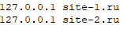
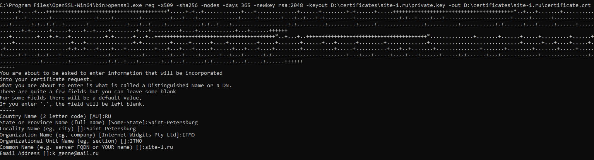
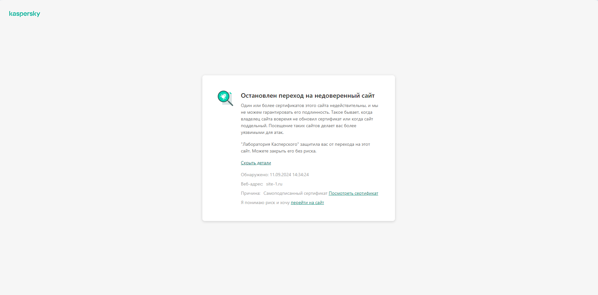
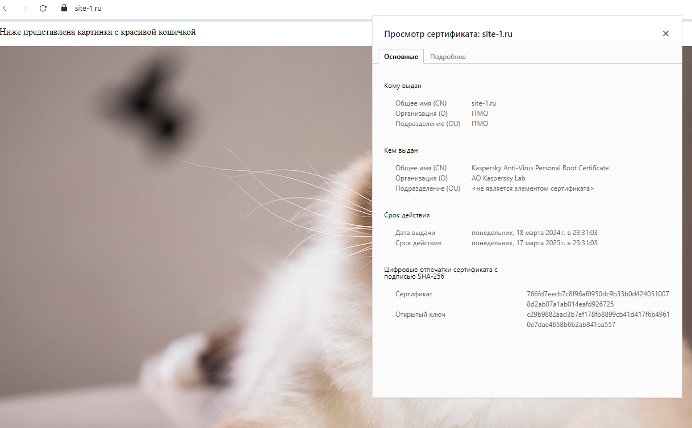
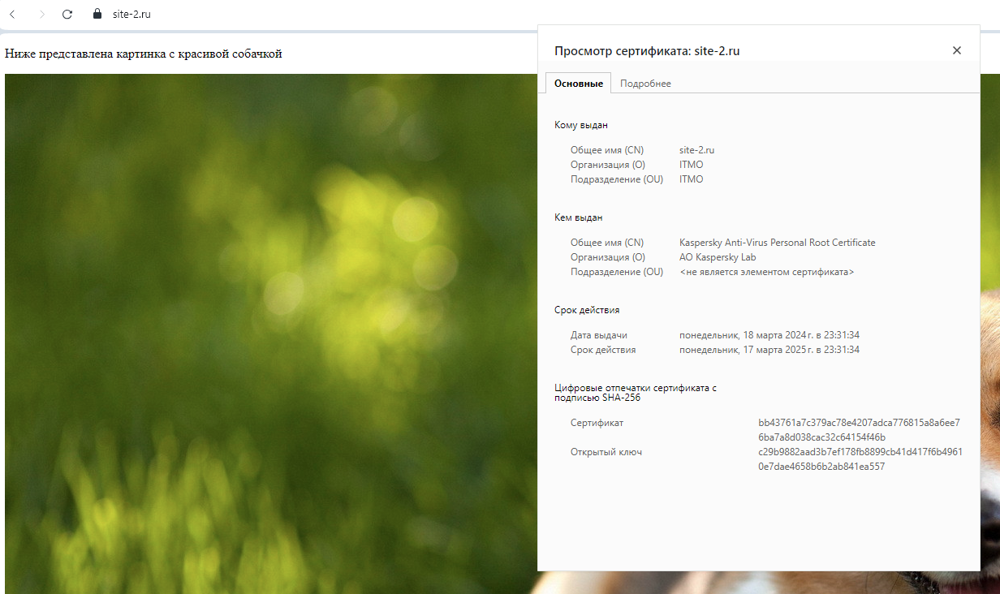

# Отчёт по лабораторной работе №1

Выполнили: Генне Константин K3240 и Савченко Анастасия K3241

## Техническое задание
1. Подключение должно осуществляться через протокол https с сертификатом;
2. Настроить принудительное перенаправление HTTP-запросов (порт 80) на HTTPS (порт 443) для обеспечения безопасного соединения;
3. Использовать alias для создания псевдонимов путей к файлам или каталогам на сервере;
4. Настроить виртуальные хосты для обслуживания нескольких доменных имен на одном сервере.

## Ход работы

Работа будет выполняться на компьютере с ОС Windows 10.

### Установка NGINX
Первым делом устанавливаем NGINX на компьютер. Для этого переходим [на официальную страницу](https://nginx.org/ru/download.html), скачиваем версию `1.26.2` и распаковываем скачанный zip-архив. Внутри него находится приложение nginx.exe, а также конфигурационный файл nginx.conf, с которым мы будем работать далее.
Запускаем NGINX, кликнув два раза по иконке приложения.
Чтобы убедиться в том, что NGINX работает, перейдем в браузер и в адресной строке введём http://localhost. Должна открыться страница, как на картинке ниже.


### Создание двух простых проектов
Для дальнейшей работы нам потребуется два простеньких проекта. Создадим одностраничные сайты, состоящие из одного блока текста и одного изображения. Код есть в репозитории.

Сайты будут иметь доменные имена: `site-1.ru` и `site-2.ru`.

В файл `hosts` (путь: `C:\Windows\System32\drivers\etc\hosts`) добавим домены наших сайтов, чтобы при обращении к ним запросы отправлялись на наш сервер.


### Создание самоподписанного SSL-сертификата
Для обеспечения HTTPS-соединения создадим самоподписанный SSL-сертификат. Для этого нам потребуется утилита OpenSSL, которую можно скачать [здесь](https://slproweb.com/products/Win32OpenSSL.html).

После установки открываем Командную строку Windows, переходим в директорию с программой openssl.exe и набираем следующую команду: `req -x509 -sha256 -nodes -days 365 -newkey rsa:2048 -keyout D:\certificates\site-1.ru\private.key -out D:\certificates\site-1.ru\certificate.crt` для создания ключа и сертификата. Далее потребуется ввести запрашиваемую информацию, как на картинке.



Аналогичную работу проводим для второго проекта.

### Принудительное перенаправление запросов на HTTPS
Переходим к нашему конфигурационному файлу nginx.conf. Для редактирования будем использовать программу Notepad++. Для редактирования файла потребуются права администратора.

В контексте `http {...}`пропишем блочную директиву `server {...}`.
```
server {
        listen       80;
        server_name  _;
		
		return 301 https://$server_name$request_uri;
    }
```
Здесь мы дали команду системе "слушать" порт 80 и перехватывать весь HTTP-траффик. Строка `server_name _` указывает на то, что это будет работать для любого имени хоста. Строчка `return 301 https://$server_name$request_uri` отвечает за переадресацию. Переменная `$server_name` используется для передачи доменного имени, а `$request_uri` - для сохранения исходного адреса запроса.

Напишем ещё две блочные директивы  `server {...}`, принимающие только SSl-соединения через порт 443, для наших сайтов `site-1.ru` и `site-2.ru`. Обязательно указываем пути к сертификату и ключу.

```
	server {
        listen       443 ssl;
        server_name  site-1.ru;

        ssl_certificate      "D:\certificates\site-1.ru\certificate.crt";
        ssl_certificate_key  "D:\certificates\site-1.ru\private.key";
		
		root   "D:\ITMO\DevOps_and_Clouds\DevOps_lab_1\site-1";
		index  index.html;
    }
	
    server {
        listen       443 ssl;
        server_name  site-2.ru;

        ssl_certificate      "D:\certificates\site-2.ru\certificate.crt";
        ssl_certificate_key  "D:\certificates\site-2.ru\private.key";

		root   "D:\ITMO\DevOps_and_Clouds\DevOps_lab_1\site-2";
        index  index.html;
    }
```

После сохранения изменений в конфигурационном файле, если nginx уже был запущен, не обходимо в Командной строке Windows прописать команду `nginx -s reload` для запуска новых рабочих процессов с новой конфигурацией. Если nginx не был запущен до внесения правок, то достаточно его просто запустить. Проверить, запущен ли nginx, можно в Диспетчере задач во вкладке "Фоновые процессы".

Теперь всё должно работать. Вводим `site-1.ru` в адресной строке браузера и переходим на страницу. Если на компьютере установлен антивирус, то, вероятно, он предупредит о переходе на недостоверный сайт. Это происходит из-за самоподписанного сертификата, так как такой сертификат не заверяется проверенным удостоверяющим центром. Однако мы уверены в безопасности нашего сайта, поэтому нажимаем "перейти на сайт".


Полюбуемся сайтами:



### Использование alias
Будем использовать alias для создания псевдонимов путей к нашим изображениям на сайтах.

В блоки `server {...}` для двух проектов добавим следующие строки.
```
	location /images {
		alias "D:\ITMO\DevOps_and_Clouds\DevOps_lab_1\site-1\static\img";
	}	
```

```
	location /images {
		alias "D:\ITMO\DevOps_and_Clouds\DevOps_lab_1\site-2\static\img";
	}
```

Например, запрос `https://site-1.ru/images/cat-1.jpg` будет приводить к файлу, находящемуся по пути `D:\ITMO\DevOps_and_Clouds\DevOps_lab_1\site-1\static\img\cat-1.jpg`.

## Вывод
В ходе выполнения лабораторной работы нам удалось полностью выполнить техническое задание: были настроены виртуальные хосты для обслуживания двух доменных имён на сервере (`site-1.ru` и `site-2.ru`), использован alias для создания псевдонимов путей к изображениям на сайтах, установлено принудительное перенаправление HTTP-запросов (порт 80) на HTTPS (443 порт), созданы самоподписанные сертификаты для обеспечения HTTPS-соединения.
