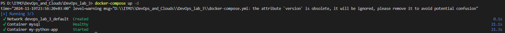
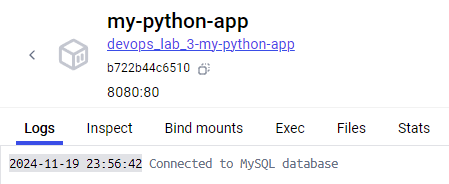
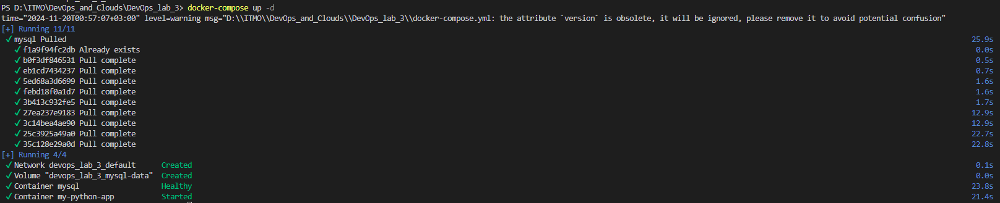
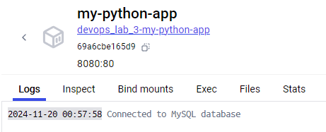
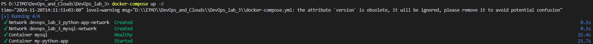
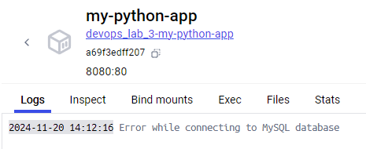

# Отчёт по лабораторной работе 2*

Выполнили: Генне Константин K3240 и Савченко Анастасия K3241

## Техническое задание

1. Написать “плохой” Docker compose файл, в котором есть не менее трех “bad practices” по их написанию;
2. Написать “хороший” Docker compose файл, в котором эти плохие практики исправлены;
3. В Readme описать каждую из плохих практик в плохом файле, почему она плохая и как в хорошем она была исправлена, как исправление повлияло на результат;
4. После предыдущих пунктов в хорошем файле настроить сервисы так, чтобы контейнеры в рамках этого compose-проекта так же поднимались вместе, но не "видели" друг друга по сети. В отчете описать, как этого добились и кратко объяснить принцип такой изоляции.

## Ход работы

### "Плохой" и "Хороший" docker-compose файлы

**"Плохой" docker-compose файл**
```
version: "3"

services:
  my-python-app:
    build:
      context: app
    container_name: my-python-app
    ports:
      - "8080:80"
    depends_on:
      mysql:
        condition: service_healthy
    environment:
      MYSQL_HOST: mysql
      MYSQL_DATABASE: databasename
      MYSQL_USER: myuser
      MYSQL_PASSWORD: mypassword

  mysql:
    image: mysql:latest
    container_name: mysql
    ports:
      - "3306:3306"
    environment:
      MYSQL_ROOT_PASSWORD: rootpassword
      MYSQL_DATABASE: databasename
      MYSQL_USER: myuser
      MYSQL_PASSWORD: mypassword
    healthcheck:
      test: ["CMD", "mysqladmin", "ping", "-h", "localhost"]
      interval: 20s
      retries: 5
```

Убедимся, что и с "плохим" docker-compose файлом всё работает.





Приложение сообщило, что подключение к базе данных прошло успешно, значит наши контейнеры видят друг друга.


**"Хороший" docker-compose файл**
```
version: "3"

services:
  my-python-app:
    build:
      context: app
    container_name: my-python-app
    ports:
      - "8080:80"
    depends_on:
      mysql:
        condition: service_healthy
    environment:
      MYSQL_HOST: mysql
      MYSQL_DATABASE: ${MYSQL_DATABASE}
      MYSQL_USER: ${MYSQL_USER}
      MYSQL_PASSWORD: ${MYSQL_PASSWORD}
  
  mysql:
    image: mysql:8.4
    container_name: mysql
    ports:
      - "127.0.0.1:3306:3306"
    environment:
      MYSQL_ROOT_PASSWORD: ${MYSQL_ROOT_PASSWORD}
      MYSQL_DATABASE: ${MYSQL_DATABASE}
      MYSQL_USER: ${MYSQL_USER}
      MYSQL_PASSWORD: ${MYSQL_PASSWORD}
    volumes:
      - mysql-data:/var/lib/mysql
    healthcheck:
      test: ["CMD", "mysqladmin", "ping", "-h", "localhost"]
      interval: 20s
      retries: 5

volumes:
  mysql-data:
```

Проверяем, что ничего не поломалось и всё работает)




Супер! Теперь опишем, что было сделано.

### Описание плохих практик

**1. Использование тега latest вместо конкретной версии**
```
mysql:
  image: mysql:latest
```
Тег `latest` указывает на последнюю доступную версию образа, что может привести к неконтролируемым изменениям и обновлениям и негативно повлиять на работу контейнера в будущем.

```
mysql:
  image: mysql:8.4
```
В хорошем файле для базового образа `mysql` была указана конкретная версия. Мы можем быть уверены, что через некоторое время всё будет работать так, как было задумано.

**2. Публикация всех портов на 0.0.0.0**
```
mysql:
  ports:
    - "3306:3306"
```
Публикация портов без ограничений ("3306:3306") открывает доступ к сервисам, таким как база данных, извне, что создаёт угрозы безопасности.

```
mysql:
  ports:
    - "127.0.0.1:3306:3306"
```
В хорошем файле было установлено ограничение видимости порта базы данных на локальный хост, чтобы он был доступен только локальным сервисам.

**3. Явно заданные переменные окружения внутри файла docker-compose**
```
mysql:
  environment:
    MYSQL_ROOT_PASSWORD: rootpassword
    MYSQL_DATABASE: databasename
    MYSQL_USER: myuser
    MYSQL_PASSWORD: mypassword

my-python-app:
  environment:
    MYSQL_HOST: mysql
    MYSQL_DATABASE: databasename
    MYSQL_USER: myuser
    MYSQL_PASSWORD: mypassword
```

Явное указание данных для подключения непосредственно внутри файла docker-compose делает их уязвимыми для кражи.

```
mysql:
  environment:
    MYSQL_ROOT_PASSWORD: ${MYSQL_ROOT_PASSWORD}
    MYSQL_DATABASE: ${MYSQL_DATABASE}
    MYSQL_USER: ${MYSQL_USER}
    MYSQL_PASSWORD: ${MYSQL_PASSWORD}

my-python-app:
  environment:
    MYSQL_HOST: mysql
    MYSQL_DATABASE: ${MYSQL_DATABASE}
    MYSQL_USER: ${MYSQL_USER}
    MYSQL_PASSWORD: ${MYSQL_PASSWORD}
```

Все данные были перемещены в отдельный файл `.env`. Такое решение позволит улучшить безопасность проекта.

**4. Не монтирование нужной информации**
При каждом перезапуске "плохого" docker-compose файла мы теряем данные нашей БД.

```
mysql:
  volumes:
    - mysql-data:/var/lib/mysql

volumes:
  mysql-data:
```

Если есть необходимость сохранять данные, полученные в процессе работы с контейнерами, после перезапуска docker-compose, можно использовать именованный `volume` для хранения данных вне контейнера.

### Контейнеры в разных сетях
```
version: "3"

services:
  my-python-app:
    build:
      context: app
    container_name: my-python-app
    ports:
      - "8080:80"
    depends_on:
      mysql:
        condition: service_healthy
    environment:
      MYSQL_HOST: mysql
      MYSQL_DATABASE: ${MYSQL_DATABASE}
      MYSQL_USER: ${MYSQL_USER}
      MYSQL_PASSWORD: ${MYSQL_PASSWORD}
    networks:
      - python-app-network
  
  mysql:
    image: mysql:8.4
    container_name: mysql
    ports:
      - "127.0.0.1:3306:3306"
    environment:
      MYSQL_ROOT_PASSWORD: ${MYSQL_ROOT_PASSWORD}
      MYSQL_DATABASE: ${MYSQL_DATABASE}
      MYSQL_USER: ${MYSQL_USER}
      MYSQL_PASSWORD: ${MYSQL_PASSWORD}
    volumes:
      - mysql-data:/var/lib/mysql
    healthcheck:
      test: ["CMD", "mysqladmin", "ping", "-h", "localhost"]
      interval: 20s
      retries: 5
    networks:
      - mysql-network

volumes:
  mysql-data:

networks:
  mysql-network:
    driver: bridge
  python-app-network:
    driver: bridge
```

Для контейнера `mysql` создана сеть `mysql-network`, а для контейнера `my-python-app` сеть `python-app-network`.
Теперь контейнеры поднимаются вместе, но не видят друг друга по сети.

Проверяем, что всё собралось.


Убедимся, что контейнер `my-python-app` не видит контейнер `mysql`:


## Вывод
В ходе выполнения лабораторной работы мы изучили новую для себя технологию и попрактиковались поднимать контейнеры с помощью docker-compose, разобрали часто встречающиеся плохие практики и то, как их надо исправлять. Техническое задание выполнено. Приступаем к облачным лабам)))
